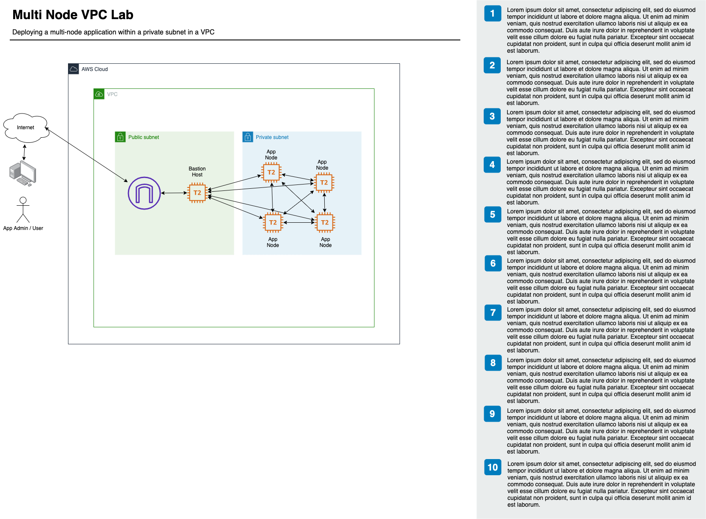

# Lab 1 - My First VPC on AWS

## Create the VPC
[review this script](create_vpc.sh)

## Create the SSH key
[review this script](create_keypair.sh)

## Create the EC2 instance
[review this script](create_ec2_in_vpc.sh)

## Clean up
[review this script](cleanup.sh)

